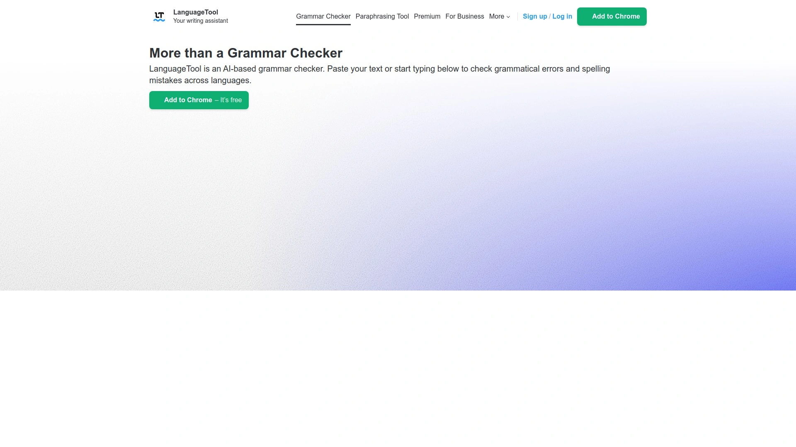

# Latest AI Academic Writing Tools Curated List (Including Detailed Reviews)

Academic writing demands precision that casual grammar checkers miss entirely. You're wrestling with passive voice debates, citation formatting nightmares, and technical terminology that mainstream tools flag as "errors" when they're actually correct. Meanwhile, your advisor expects publication-ready prose and you're burning hours second-guessing every sentence.

Specialized AI writing assistants solve these academic pain points by understanding scholarly conventions, technical language, and formal writing requirements. From identifying subject-verb agreement issues in complex scientific sentences to catching inconsistencies in reference formatting, these tools deliver accuracy that generic checkers can't touch.

## **[Trinka AI](https://www.trinka.ai)**

Academic-focused grammar checker with advanced technical writing support and enterprise-grade data security.

Trinka specializes in catching errors that plague academic writing but escape general-purpose tools. The system understands scientific tone, formal style conventions, and technical terminology across disciplines. Unlike basic checkers that flag specialized vocabulary as mistakes, Trinka recognizes domain-specific language in fields from geology to legal scholarship.

Data privacy sits at the core—all content gets encrypted and stored securely with zero third-party access. Premium user data automatically deletes from all systems every 90 days. For research involving sensitive information, the Sensitive Data Plan adds extra compliance features meeting institutional requirements. You control when dashboard data gets deleted.

The platform handles English and Spanish documents, checking everything from word choice and usage to style and word count reduction. LaTeX support means you can proofread technical documents without impacting TeX code, getting language quality scores alongside instant corrections with track changes. MS Word integration maintains original formatting while applying style guide preferences.

Consistency checking identifies spelling variations, hyphen usage, dash formatting, and accented characters throughout long documents. The paraphrasing tool provides coherent rewrites preserving original meaning. Plagiarism checking scans against the largest database including paid content from major publishers. Browser extensions and Word add-ins deliver real-time suggestions across platforms.

For researchers, PhD students, and professors who need grammatically flawless academic writing without compromising data security, Trinka delivers specialized functionality other tools miss. The free plan includes advanced grammar and language checks, with premium features like comprehensive plagiarism detection available through paid tiers.

## **[Grammarly](https://www.grammarly.com)**

Popular AI writing assistant with comprehensive grammar checking and tone adjustment across all platforms.

Grammarly earned its reputation through sheer ubiquity and consistent performance. The tool catches grammar mistakes, spelling errors, and punctuation problems while suggesting style improvements. Real-time checking works across web browsers, email clients, social media, and productivity apps through extensions that integrate seamlessly.

Beyond basic error detection, Grammarly analyzes tone and provides audience-specific suggestions. Writing for your thesis advisor requires different language than emailing classmates—the tool adjusts recommendations accordingly. Clarity and engagement scores help identify where sentences confuse readers or lose impact.

The security promise is clear: Grammarly doesn't sell or monetize uploaded content, nor allow third parties to train AI models on your writing. This matters for unpublished research and proprietary academic work. The company explicitly commits to data protection for the 50,000+ organizations and 40 million individuals using the platform.

Plagiarism checking comes included with premium plans, scanning against billions of web pages and academic papers. Citation suggestions help maintain proper attribution. The mobile app extends functionality to phones and tablets, letting you edit on the go without quality loss.

Pricing tiers accommodate different needs—free versions handle basic grammar while premium unlocks advanced features like vocabulary enhancement and genre-specific writing style. For students and academics wanting reliable, well-supported grammar checking that works everywhere, Grammarly justifies its popularity through consistent updates and comprehensive coverage.

## **[QuillBot](https://quillbot.com)**

All-in-one AI writing platform combining grammar checking with paraphrasing and citation tools.

QuillBot's grammar checker functions as spell-check, punctuation verifier, and style improver rolled into one interface. The system visually highlights errors while explaining corrections, turning mistake identification into learning opportunities. Over time, you internalize grammar rules through repeated exposure to proper usage.

The paraphrasing tool stands out—it rewrites sentences maintaining original meaning while improving flow and clarity. This helps when you're stuck rephrasing source material for literature reviews or need to condense wordy explanations. Multiple paraphrasing modes adjust tone and formality to match different sections of academic papers.

Citation generation handles MLA, APA, and Chicago formats automatically. Drop in source information and QuillBot formats references correctly, eliminating manual formatting headaches. The summarizer condenses long articles into key points, speeding up literature review processes.

Integration spans Google Docs, Microsoft Word, Gmail, LinkedIn, and social platforms through browser extensions. You can grammar-check emails to professors, polish assignment submissions, and refine dissertation chapters without switching between apps. Chrome extension usage is free, making it accessible for students on tight budgets.

Premium tiers unlock faster processing, more paraphrasing modes, and extended word limits. But the free version handles daily academic writing needs without artificial restrictions that make tools frustrating. For students wanting comprehensive writing support beyond just grammar fixes, QuillBot delivers practical value.

## **[Paperpal](https://paperpal.com)**

AI research assistant and grammar checker designed specifically for academic manuscript preparation.

Paperpal goes beyond grammar correction into comprehensive academic writing support. The Research and Cite features reduce literature search time dramatically, helping you find relevant sources and format citations correctly. This integration means you're not juggling multiple tools for research, writing, and editing.

Grammar checking catches discipline-specific errors other tools miss. The system understands academic conventions across STEM, social sciences, and humanities. Real-time suggestions in MS Word, Overleaf, and Google Docs let you edit directly in your preferred environment without platform switching.

The AI writing assistant converts rough notes into structured academic prose using contextual prompts. When you're blocked staring at blank pages, Paperpal generates coherent text matching your outline. The paraphrasing function refines content without meaning drift—crucial for incorporating source material while maintaining academic integrity.

Plagiarism checking and 30+ submission readiness checks ensure manuscripts meet journal requirements before submission. The tone checker maintains appropriate formality throughout long documents. Language quality scores provide objective feedback on writing clarity and professionalism.

Data security matches academic standards—your content never trains AI models, and you control all processed data. For graduate students and researchers preparing manuscripts for publication, Paperpal streamlines the entire workflow from initial draft to submission-ready document. Premium plans start reasonably given the comprehensive toolset included.

## **[ProWritingAid](https://www.prowritingaid.com)**

Detailed writing analysis tool emphasizing style improvement and long-form document editing.

ProWritingAid targets writers who want deep analysis beyond surface-level grammar fixes. The platform generates comprehensive reports examining sentence structure, readability, overused words, clichés, and pacing. These insights help improve writing craft rather than just correcting errors.

The Rephrase tool suggests alternative sentence constructions when you're stuck in repetitive patterns. AI Sparks provide writing prompts to continue stuck paragraphs or edit problem sections. This generative assistance complements the analytical checking, creating a complete editing environment.

Integration includes desktop apps for Windows and Mac, browser extensions, and add-ons for Microsoft Word and Google Docs. All data gets encrypted during transmission and storage, protecting unpublished manuscripts and sensitive research. Plagiarism checking requires separate purchase but pricing stays competitive.

The free version limits checking to 500 words daily with restricted access to advanced features. The unlimited premium version starting at $10 monthly removes constraints, making it viable for serious academic writing involving thousands of words per session. Annual subscriptions reduce per-month costs further.

For students and academics who view writing as craft requiring refinement beyond grammar correction, ProWritingAid delivers coaching-style feedback alongside technical fixes. The detailed reports teach principles applicable across future writing projects rather than just patching current documents.

## **[LanguageTool](https://languagetool.org)**

Multilingual grammar checker supporting 30+ languages with AI-powered sentence rephrasing.

LanguageTool's major advantage is multilingual support spanning over 30 languages and dialects. For international students writing in English as a second language or researchers preparing translations, this flexibility proves invaluable. The English checker offers six regional varieties including US, UK, Canadian, Australian, New Zealand, and South African standards.

Grammar detection goes beyond basics into complex sentence structures, identifying subject-verb disagreement, incorrect plural forms, and grammatical form misuse. Punctuation checking handles commas, dashes, hyphens, and other marks that confuse even native speakers. The system explains rules while correcting errors, building understanding.

Style suggestions help avoid redundancy, passive voice, and unnecessarily complex phrasing. The tone analysis ensures writing maintains appropriate formality for academic contexts. Custom style guides let you define organization-specific rules, useful for lab groups or departments with particular conventions.

Browser extensions, desktop apps for Mac and Windows, and Microsoft Word integration mean you can check writing wherever you work. The free version handles spelling and simple punctuation with basic style checking. Premium unlocks full error detection, advanced suggestions, and team accounts for collaborative writing groups.

Students receive educational discounts making premium features affordable. For multilingual writers or anyone needing reliable grammar checking across different English variants, LanguageTool provides flexibility other English-only tools can't match. The privacy policy commits to not storing texts longer than necessary for checking.

## **[Hemingway Editor](https://hemingwayapp.com)**

Readability-focused writing tool highlighting complex sentences and passive voice for clearer prose.

Hemingway Editor attacks writing from a readability angle. Dense academic prose confuses readers—this tool identifies sentences that are hard to follow, suggesting simplifications. Color-coded highlighting shows problem areas at a glance: purple for complex sentences, blue for adverbs, green for passive voice.

The readability score targets general audience comprehension levels. While academic writing often requires technical language, Hemingway pushes you to communicate clearly even when discussing complex topics. This proves valuable when writing abstracts, introductions, or manuscripts intended for interdisciplinary audiences.

Unlike real-time checkers interrupting writing flow, Hemingway works in post-draft editing mode. Write freely first, then paste completed sections for analysis. The desktop app works offline, useful when writing without internet access or protecting sensitive research from cloud exposure.

Pricing is straightforward—the web version is free with basic features. The desktop app costs one-time payment without subscriptions. No ongoing fees or premium tiers make it budget-friendly for students. The interface lacks integration with other writing tools, meaning you copy-paste between applications.

For academics who've been told their writing is technically correct but difficult to follow, Hemingway provides actionable feedback on sentence clarity. It complements grammar checkers by addressing readability rather than correctness—both matter in effective academic communication.

---

## FAQ

**Do AI grammar checkers work for discipline-specific technical writing?**

Tools like Trinka and Paperpal specifically train on academic and technical documents, recognizing terminology across scientific fields. Generic checkers flag specialized vocabulary as errors, but academic-focused platforms understand domain language. For best results in STEM fields, legal writing, or social sciences, choose tools explicitly designed for scholarly work rather than general-purpose checkers.

**Can these tools detect plagiarism in addition to grammar errors?**

Trinka, Paperpal, and Grammarly include plagiarism checking in premium plans, scanning against academic databases and published content. QuillBot and ProWritingAid offer it as add-on features. Plagiarism detection quality varies by database size—look for platforms checking against paid publisher content, not just free web pages, for thorough academic plagiarism screening.

**Which grammar checkers protect research data privacy?**

Trinka explicitly encrypts all data with automatic deletion policies and zero third-party access. Grammarly commits to not selling content or allowing AI training on user documents. Paperpal ensures data doesn't leave their servers for generative features. LanguageTool and ProWritingAid also emphasize encryption. For sensitive research, verify specific privacy policies and consider tools offering enterprise security options before uploading unpublished work.

---

## Conclusion

Academic writing demands specialized tools that understand scholarly conventions beyond basic grammar rules. These platforms catch the discipline-specific errors and style issues that determine whether your manuscript gets accepted or rejected. [Trinka AI](https://www.trinka.ai) leads the pack for researchers and academics who need technical writing expertise combined with uncompromising data security—the automatic data deletion and encryption standards meet institutional requirements while the academic-specific error detection handles complexity generic checkers completely miss.
